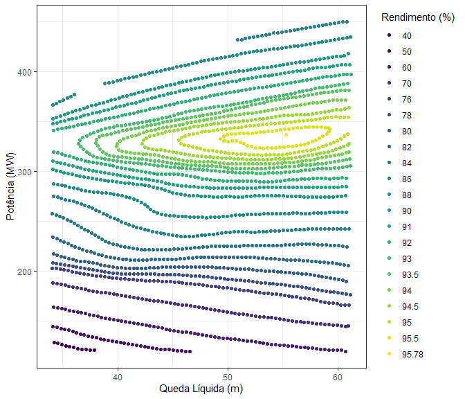

<!-- README.md is generated from README.Rmd. Please edit that file -->
<!-- badges: start -->

[](https://github.com/lkhenayfis/gtdp-curvacolina/actions)
[](https://github.com/lkhenayfis/gtdp-curvacolina/actions)
[](https://codecov.io/gh/lkhenayfis/gtdp-curvacolina)
<!-- badges: end -->

# curvacolina

Pacote com funcoes facilitadoras da importacao de planilhas de curva
colina, visualizacao e modelagem das mesmas para interpolacao.

## Instalacao

Este pacote ainda nao se encontra disponibilizado no CRAN, de modo que
deve ser instalado diretamente a partir do repositorio utilizando:

``` r
# Caso a biblioteca remotes nao esteja instalada, execute install.packages("remotes") primeiro
remotes::install_github("lkhenayfis/gtdp-curvacolina", build_vignettes = TRUE)
```

## Exemplo de uso

Abaixo esta um trecho de codigo exemplificando de forma simplificada o
uso das funcionalidades contidas neste pacote. Um manual de uso pode ser
acessado através de `vignette("curvacolina")` e mais detalhes acerca das
funcoes se encontram em suas respectivas paginas de ajuda.

``` r
library(curvacolina)

# leitura de uma curva colina (usando planilha embutida no pacote)
arq_colina <- system.file("extdata/colina.xlsx", package = "curvacolina")
colina     <- learqcolina(arq_colina)

# visualizacao
plot(colina, "2d")
```



Com o objeto `colina` lido, podemos ajustar e plotar um interpolador
sobre ele…

``` r
superf <- interpolador(colina, metodo = "triangulacao")

plot(superf, "2d")
```


… e extrair uma grade em formato padronizado

``` r
# extrai uma grade regular a partir do dominio da curva colina
pontos <- coordgrade(colina, dhl = 40:60, dpot = seq(200, 400, by = 10))

# calcula rendimentos interpolados nos pontos de grade
grade <- predict(superf, pontos, as.gradecolina = TRUE)

grade[[1]]
#>      hl pot     rend inhull
#>   1: 40 200 78.67424   TRUE
#>   2: 41 200 78.92752   TRUE
#>   3: 42 200 79.00653   TRUE
#>   4: 43 200 78.94092   TRUE
#>   5: 44 200 78.97493   TRUE
#>  ---                       
#> 437: 56 400 91.02819   TRUE
#> 438: 57 400 91.18985   TRUE
#> 439: 58 400 91.34657   TRUE
#> 440: 59 400 91.47022   TRUE
#> 441: 60 400 91.61852   TRUE
```
